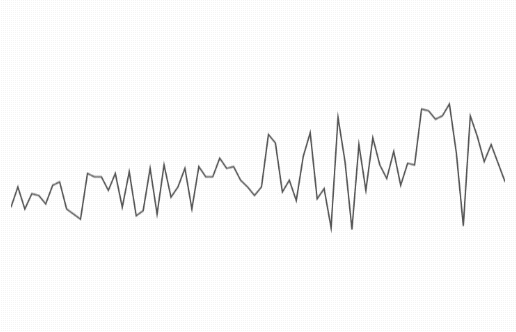
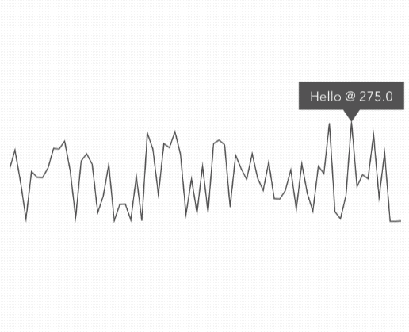

# ChartDynamicKit
📈 Easily Create Hyper-Minimal Dynamic Charts 📉

## Usage
A dynamic chart is created through the ``ChartDynamicKit`` object.

### Instantiate ###

```swift
var chartDynamic = ChartDynamicKit(
	line: minLine
)
```
*Note:* ``minLine`` is an ``@IBOutlet`` from the storyboard.

### Set Data ###

```swift
chartDynamic.set(data:myData)
```
*Note:* ``myData`` is an array of ``Double``'s

### Start ###

```swift
chartDynamic.start()
```

Depending on your data, your chart will look something like this:



### Stop ###

You can easily stop the chart with:

```swift
chartDynamic.stop()
```

or let the framework handle state change with:

```swift
chartDynamic.toggleState()
```

### Delegate ###

To get notified when the chart updates or to add a marker to the chart conform to the ``ChartDynamicDelegate``:

```swift
chartDynamic.delegate = self
```

The two methods available are:

#### ``chartDynamicUpdate(index:Int)`` ####
Called each time the chart changes

```swift
func chartDynamicUpdate(index: Int) {
	let value = myData[index]
	updateUI(value)
}
```

#### ``chartDynamicMarkerTag(index: Int)->MarkerTag?`` ####
To pass a marker if the ``index`` requires it (or ``nil``)

```swift
func chartDynamicMarkerTag(index: Int)->MarkerTag? {
	let value = myData[index]
	if shouldBeMarked(value) {
		return MarkerTag(name:"Hello", value:value)
	} else { return nil }
}
```

Depending on your data and how your ``shouldBeMarked(value)`` method is implemented, your chart will look something like this:



## On the Sholders...
*ChartDynamicKit* is built on top of [*``MinChartKit``*](https://github.com/stevewight/MinChartKit) and leverages the ``MinLine`` class at it's core.

Take a look at the [*``MinChartKit``*](https://github.com/stevewight/MinChartKit) README for more details.

## Installation

The easiest way to use *MinChartKit* is with CocoaPods

### Installation with CocoaPods
To integrate *ChartDynamicKit* into your Xcode project using CocoaPods, specify it in your `Podfile`:

```ruby
platform :ios, '11.0'

target 'TargetName' do
  pod 'ChartDynamicKit', :git => 'https://github.com/stevewight/ChartDynamicKit.git'
end
```

Then, run the following command:

```bash
$ pod install
```

## Pre-Release Version

This is a pre-release version of *ChartDynamicKit* and although it is stable and should be working in all the above cases, things will be added, changed and potentially break.

## License

*ChartDynamicKit* is released under an **MIT** license.
